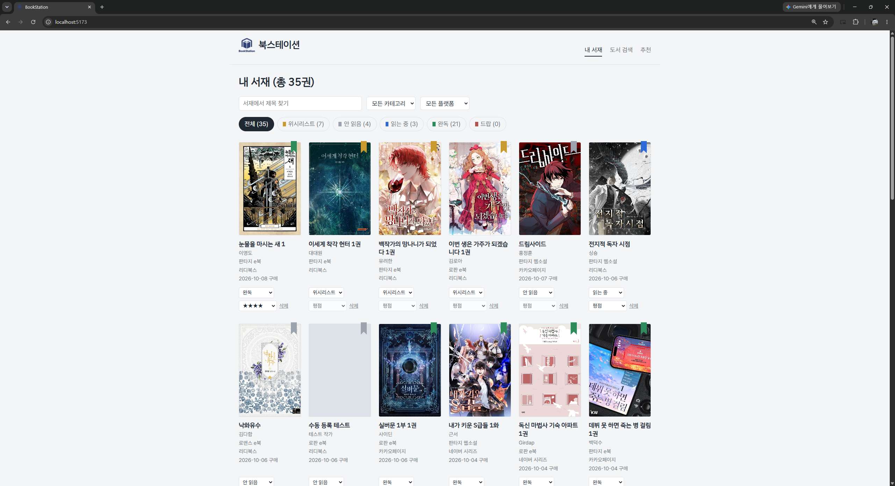
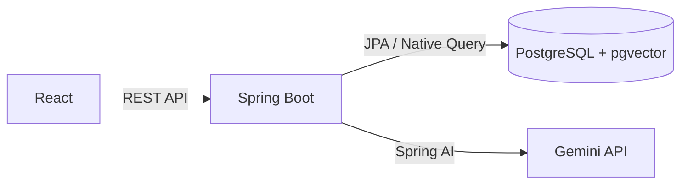

# 북스테이션 (BookStation)

리디북스, 카카오페이지, 네이버 시리즈에 흩어져 있는 웹소설과 e북을 **한 서재에 모아 관리**하고, 내 독서 기록을 바탕으로 **AI가 다음에 읽을 책을 추천**해 주는 서비스입니다.

- 개발 기간: 2026.09.26 ~ 2026.10.
- 개발 인원: 1인 (백엔드, 프론트엔드, 데이터 수집)
- 설계 문서: [요구사항 정의서, 테이블 정의서 (Notion)](https://app.notion.com/p/BookStation-E-BOOK-3dcb5f43b00980fa9a9dfceb7badfb8d?source=copy_link)
- 프론트엔드 저장소: [BookStation-frontend](https://github.com/alpenglow93/BookStation-frontend)

<!-- 화면 캡처: 내 서재 / 도서 검색 / AI 추천 / 상세 모달 -->
<!--  -->

---

## 기술 스택

| 구분 | 사용 기술 |
| --- | --- |
| Backend | Java 21, Spring Boot 4.1, Spring Data JPA (Hibernate 7) |
| Database | PostgreSQL 16, pgvector |
| AI | Spring AI 2.0, Google Gemini (gemini-3.5-flash, gemini-embedding-001 / 768차원) |
| API 문서 | springdoc-openapi (Swagger UI) |
| Frontend | React, TypeScript, Vite, axios, react-router-dom |
| 데이터 | 리디북스 도서 약 4,300권 수집, 줄거리 임베딩 사전 생성 |

---

## 주요 기능

**내 서재**
- 도서 검색 후 구매 플랫폼과 읽기 상태를 골라 서재에 담기
- 읽기 상태 관리: 위시리스트 / 안 읽음 / 읽는 중 / 완독 / 드랍
- 상태, 카테고리, 플랫폼 필터와 제목 검색
- 평점, 메모 기록 (평점은 읽는 중·완독·드랍 상태에서만)
- 상세 보기에서 줄거리 확인
- 검색 결과에 없는 도서는 직접 등록 (줄거리 임베딩 자동 생성)
- 구매처·구매일 수정

**AI 취향 추천 (RAG)**
- 내 서재의 책과 평점으로 취향 벡터를 만들어 비슷한 책을 검색
- 추천된 책마다 Gemini가 "왜 추천하는지" 이유를 작성
- 로판 / 로맨스 / 판타지 카테고리별 추천

---

## 시스템 구조



추천 흐름은 두 단계입니다.

1. **검색 (Retrieval)**: PostgreSQL에서 취향 벡터와 가까운 책을 pgvector 코사인 거리로 찾습니다.
2. **생성 (Generation)**: 찾은 후보와 좋아한 작품 목록을 Gemini에 보내 추천 이유를 받습니다.

---

## 데이터 모델

| 테이블 | 설명 |
| --- | --- |
| `book` | 수집한 도서 카탈로그. 제목, 작가, 카테고리, 줄거리, 표지, 줄거리 임베딩(`vector(768)`) |
| `platform` | 구매 플랫폼 (리디북스, 카카오페이지, 네이버 시리즈) |
| `user_book` | 내 서재 기록. 도서, 플랫폼, 상태, 평점, 메모, 구매일 |

- `user_book (book_id, platform_id)`에 UNIQUE 제약: 같은 책을 같은 플랫폼으로 두 번 담지 못하게 막습니다. 같은 책을 다른 플랫폼에서 산 경우는 허용합니다.
- `status`에 CHECK 제약: 다섯 가지 상태값만 허용합니다.

---

## API

| Method | URL | 설명 |
| --- | --- | --- |
| GET | `/api/books?page=&keyword=` | 도서 목록, 제목 검색 (페이징) |
| GET | `/api/books/{id}` | 도서 상세 |
| GET | `/api/platforms` | 플랫폼 목록 |
| GET | `/api/library` | 내 서재 목록 |
| POST | `/api/library` | 서재에 담기 (중복 시 409) |
| POST | `/api/books` | 도서 직접 등록 + 서재에 담기 |
| PATCH | `/api/library/{id}` | 상태, 평점, 메모 수정 (보낸 값만 변경) |
| DELETE | `/api/library/{id}` | 서재에서 삭제 |
| GET | `/api/recommendations?category=&limit=` | AI 추천과 추천 이유 |

전체 명세는 실행 후 `/swagger-ui.html`에서 확인할 수 있습니다.

---

## 추천 기능 설계

### 취향 벡터: 평점 가중 평균

서재에서 구매한 책(안 읽음, 읽는 중, 완독)의 줄거리 임베딩을 평점에 따라 가중 평균합니다.

| 평점 | 가중치 |
| --- | --- |
| 5점 | 3 |
| 4점 | 2 |
| 3점, 평점 없음 | 1 |
| 1~2점 | 0 (제외) |

가중치만큼 행을 `generate_series`로 복제한 뒤 pgvector의 `AVG`를 구하는 방식으로, 가중 평균을 SQL 한 번에 계산합니다. 위시리스트와 드랍한 책은 취향에서 제외합니다.

### 후보 검색

- 취향 벡터와 코사인 거리(`<=>`)가 가까운 순으로 정렬
- 서재에 이미 있는 책 제외
- 카테고리를 고르면 취향 벡터와 후보 모두 그 카테고리 안에서만 계산 (여러 장르의 평균이 어중간한 중간값이 되는 문제 방지)

### 추천 이유 생성

후보 10권을 **한 번의 요청**으로 Gemini에 보내고, 응답을 Spring AI의 구조화 출력(`.entity()`)으로 Java 객체로 바로 받습니다. 응답 순서가 보장되지 않으므로 책 id 기준으로 이유를 매칭합니다.

---

## 고민한 점과 설계 결정

### 1. 같은 작품의 웹소설판과 e북판 중복 추천

웹소설은 연재 후 e북으로 묶여 출간되는 경우가 많아, 서재에 웹소설판이 있는데 e북판이 추천되는 문제가 있었습니다. 제목 규칙(`1화`, `1권`, `개정판 |` 등)이 일정하지 않아 제목만으로는 판별이 어려웠습니다.

같은 작품은 줄거리가 같거나 거의 같다는 점에 착안해 **임베딩 거리**로 판별했습니다. 실제로 측정해 보니 같은 작품은 0.02~0.03, 비슷한 장르의 다른 작품은 0.17 정도로 차이가 뚜렷해, 기준값 0.07을 정했습니다.

- 서재 작품의 다른 판본 제외: SQL에서 임베딩 거리 기준 (`NOT EXISTS`)
- 추천 결과끼리 중복 제거: Java에서 제목 정규화 + 작가 기준

### 2. 외부 AI API 장애에 대한 대응

Gemini 호출은 서버 혼잡(503), 응답 잘림, 무료 한도 초과(429) 등으로 실패할 수 있고, 개발 중 실제로 모두 겪었습니다. 추천 이유 생성이 실패해도 **추천 목록은 정상적으로 보여주도록** 구성해, 외부 API 장애가 핵심 기능 전체를 멈추지 않게 했습니다.

### 3. AI 호출 횟수 관리

무료 플랜은 모델당 하루 20회로 제한됩니다. 그래서

- 추천 페이지에 들어갈 때 자동으로 요청하지 않고 버튼을 눌렀을 때만 요청
- 받은 결과를 카테고리별로 저장해 재사용하고, 서재가 바뀌면(담기, 수정, 삭제) 저장된 결과를 무효화
- 추천 이유가 비어 있는 실패 결과는 저장하지 않음
- 후보 10권을 한 번의 요청으로 처리

### 4. 중복 등록을 두 겹으로 방어

- DB: `UNIQUE (book_id, platform_id)`로 최종 방어
- 서비스: 저장 전에 존재 여부를 확인해 `409 Conflict`와 안내 메시지로 응답

### 5. 부분 수정(PATCH)과 변경 감지

상태, 평점, 메모를 각각 바꿀 수 있도록 요청에 담긴 값만 변경합니다. 트랜잭션 안에서 엔티티 값을 바꾸면 JPA 변경 감지로 자동 저장됩니다. 위시리스트에서 다른 상태로 바뀌면 구매일을 자동으로 기록합니다. 위시리스트로 바뀌면 구매일을 비우고, 위시리스트에서 나오면 오늘 날짜를 기록합니다.

### 6. 엔티티 대신 DTO로 응답

서재 목록은 책과 플랫폼 정보를 펼친(flat) 응답 DTO로 내보내, 엔티티를 직접 노출하지 않고 화면에 필요한 값만 전달합니다.

### 7. 직접 등록한 책도 추천에 반영

등록 시 서버가 줄거리로 임베딩을 생성해 저장합니다. 크롤링 데이터와 같은 기준(줄거리만 임베딩)으로 만들어 거리 비교가 가능하고, 임베딩 생성이 실패해도 등록은 완료됩니다.

---

## 트러블슈팅

| 문제 | 원인 | 해결 |
| --- | --- | --- |
| 평점을 바꾸면 그 책이 목록 맨 뒤로 이동 | 정렬 없는 `findAll()`. PostgreSQL은 UPDATE 시 새 행 버전을 뒤에 기록 | `Sort.by(DESC, "id")`로 정렬 명시 |
| `Sort.by("created_at")`에서 필드를 찾지 못함 | Spring Data가 `_`를 경로 구분자로 해석 | `id` 기준 정렬로 변경 |
| 검색 결과의 페이지 수가 전체 도서 기준으로 나옴 | `count()`로 전체 개수를 계산 | `Page.getTotalPages()` 사용 |
| Gemini 응답이 마지막 항목에서 잘려 JSON 파싱 실패 | 출력 한도를 모델의 내부 추론이 함께 사용 | 이유 길이 지정, `max-output-tokens`, `thinking-level` 설정 |
| 수정 화면에서 테이블 잠금으로 요청이 무한 대기 | DB 도구의 수동 커밋 모드에서 `ALTER TABLE` 후 미커밋 | 커밋 후 Auto-Commit으로 변경 |
| 줄거리에 HTML 태그 잔존 | 수집 시 일부 태그 미처리 | 대상 태그만 정규식으로 골라 일괄 제거 (사전 백업, 전후 비교) |

---

## 향후 개선

- 저평점(1~2점) 도서를 취향 계산에서 감점 요소로 반영
- 평점 입력 가능 상태를 서버에서도 검증 (현재는 화면에서만 제한)
- 엔티티 필드명을 camelCase로 정리
- 직접 등록 시 카탈로그 기존 도서와의 중복 확인
- 로그인과 다중 사용자 지원
- 배포

---

## 실행 방법

### 1. 환경 변수

프로젝트 루트에 `.env` 파일을 만듭니다.

```
DB_URL=jdbc:postgresql://localhost:5432/DB이름
DB_USERNAME=
DB_PASSWORD=
GEMINI_API_KEY=
```

### 2. 데이터베이스

PostgreSQL에 pgvector 확장이 필요합니다.

```sql
CREATE EXTENSION IF NOT EXISTS vector;
```

`ddl-auto: none` 설정이므로 테이블은 미리 만들어 두어야 합니다.

### 3. 백엔드 실행

```
./gradlew bootRun
```

API 문서: `http://localhost:8080/swagger-ui.html`

### 4. 프론트엔드 실행

[BookStation-frontend](https://github.com/alpenglow93/BookStation-frontend) 저장소에서

```
npm install
npm run dev
```

`http://localhost:5173`에서 확인할 수 있습니다. 개발 서버가 `/api` 요청을 `localhost:8080`으로 전달합니다.
